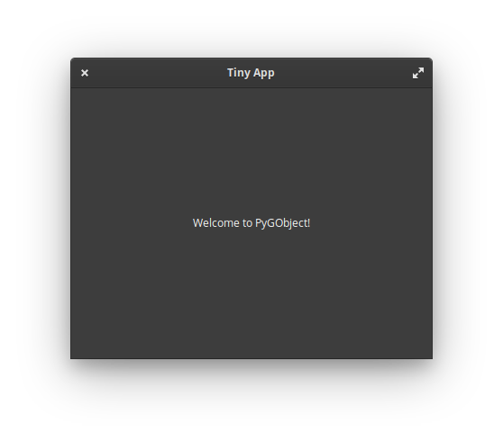

# Маленькая книга Python  и GTK

- [Вступление](#intro)
- Для кого эта книга
- Что она покрывает, а что нет
- Простой пример
- Виджеты
- Файловый менеджер
- Твиттер клиент?
- Пиксельный редактор
- Собираем приложение для Flatpak
- Собираем Snap-пакет
- deb?

## Вступление

Что такое, для чего оно нужно и что с этим всем можно делать?

Давайте вспомним, что за язык такой - Python - и для чего он нужен. Python - это интерпретируемый язык общего назначения, предназначенный как для написания скриптов, автоматизирущих обыденные процессы, например, в управлении серверами, так и для написания серверных приложений, десктопных, таких как например музыкальные плееры или даже нелинейные видеоредакторы, а также очень популярный в области машинного обучения. Он обладает легким в изучении синтаксисом, достаточным быстродействием и просто невероятной экосистемой и сообществом: если при разработке вам потребовался какой-то функционал, он наверняка уже реализован и его можно найти на PyPI - официальном репозитории пакетов. В общем, он прекрасно подходит как для новичков за счет своей дружелюбности, так и для и профессионалов, за счёт широчайших возможностей, часть из которых и будет рассмотрена в этой книге.

Одна из таких возможностей это работа с библиотеками для реализации пользовательских интерфейсов, а в нашем случае это GTK+. GTK+ - это тулкит с богатой историей, широко используемый в среде Linux-систем, в частности это то, на чем построена среда GNOME. Однако, это не означает, что он работает только под Linux, отнюдь, GTK+ приложения могут быть собраны для работы как под Windows, так и для macOS и даже для работы на ARM устройствах, например: Pine Phone. Прочитать подробнее и ознакомиться с его возможностями вы можете на официальносм сайте [gtk.org](https://gtk.org/).

Все примеры из книги были реализованы в среде [elementary OS](https://elementary.io/) на версии Python 3.6 и GTK 3.36 и доступны на Github [github.com/tenderowl/tiny-pygobject-book/](https://github.com/tenderowl/small-pygobject-book/).


## Для кого эта книга

Эта книга для тех, кто уже знаком с языком Python версии 3 и уже имеет опыт написания консольных приложений на нём, будь то серверные приложения или скрипты, знаком со стандартной библиотекой и хочет узнать о том, как можно использовать этот язык для создания приложений с графическим интерфейсом.

Книга познакомит читателя с основами библиотеки GTK3, тем, как создавать интерфейсы, некоторыми внутренними особенностями работы с GObject и тем, как поделиться своими приложениями с миром, используя возможности [Flatpak](https://flatpak.org/) и [Snapcraft](https://snapcraft.io).


## Основы GTK+

GTK+ это набор библиотек и инструментов, которые предоставляют разработчикам возможности для построения приложений с графическим интерфейсом (GUI).

Интерфейс в GTK+ состоит из виждетов - визуальных элементов программы, с которыми может взаимодействовать 
пользователь. Пожалуй, самыми известными и знакомыми виджетами являются окна, кнопки, текстовые элементы и изображения. Мы будем рассматривать их подробнее далее.

Как и большинство GUI библиотек, GTK+ работает по событийной модели: приложение ждёт пока пользователь или система, не отправит ему какое-нибудь событие, будь то щелчок мышкой по кнопке, ввод текста с клавиатуры или сигнал о том, что окно должно быть закрыто. Это "ожидание" называется __mainloop__ - главный цикл приложения. Для тех, кто знаком с тем, как работает асинхронность в Python это концепция не будет в новинку.


## Простой пример

Как и большинство учебников мы начнём с небольшого примера, дабы показать вам основу и немного подогреть ваш интерес:

```python
#!/usr/bin/env python3

import sys

# Импортируем пакет Python GI
import gi
# Указываем необходимые библиотеки и версии, требуя их наличие 
gi.require_version('Gtk', '3.0')

from gi.repository import Gtk, Gio

# Создаём класс приложения на основе базового класса из Gtk
class Application(Gtk.Application):
    def __init__(self):
        super().__init__(application_id='com.github.tenderowl.tiny-app',
                         flags=Gio.ApplicationFlags.FLAGS_NONE)

    # Виртуальная функция вызываемая при активации приложения
    def do_activate(self):
        # Проверяем, нет создано ли ещё основное окно приложения
        win = self.props.active_window
        if not win:
            # Создаём окно, указывая его основные параметры: 
            # в нашем случае это размер и заголовок
            win = Gtk.ApplicationWindow(application=self)
            win.set_default_size(400, 300)
            win.set_title('Tiny App')
            
            # Создаём Gtk.Label для вывода текста и задаём ему нужные параметры
            # По умолчанию, виджеты в Gtk невидимы, нужно явно указать их видимость
            label = Gtk.Label(
                label='Welcome to PyGObject!',
                visible=Truе
            )
            
            # Добавляем созданный виджет в окно приложения
            win.add(label)
        
        # Показывем приложение
        win.present()


def main():
    app = Application()
    return app.run(sys.argv)


# Запускаем приложение при вызове файла
if __name__ == '__main__':
    main()

```

Вы можете сохранить этот код в файл `tiny_app.py` и выполнить его в консоли с помощью команды `python3 ./tiny_app.py`. В результате откроется окно GTK которое выглядит примерно так.

<div align="center">
  
</div>

Давайте разберём этот пример. Итак, первый делом нужно указать интерпретатору какие пакеты нам понадобятся (стр. 6), а в случае с GTK+, указать ещё и необходимые версии (стр. 8). После этой процедуры, можно смело импортировать указанные модули. Вот в чем дело: работа с GTK+ реализуется с помощью PyGObject - пакеты, который предоставляет байндинги (привязки) для библиотек, основанных на [GObject](https://developer.gnome.org/gobject/stable/). Сюда входит не только наш графический фреймворк, но и огромное множество других, например: [GStreamer](https://gstreamer.freedesktop.org/), [WebKitGTK](https://webkitgtk.org/), [GLib](https://developer.gnome.org/glib/stable/), [GIO](https://developer.gnome.org/gio/stable/), [Granite](https://github.com/elementary/granite/) и множество других.

## Виджеты


## Файловый менеджер


## Твиттер клиент?


## Пиксельный редактор

